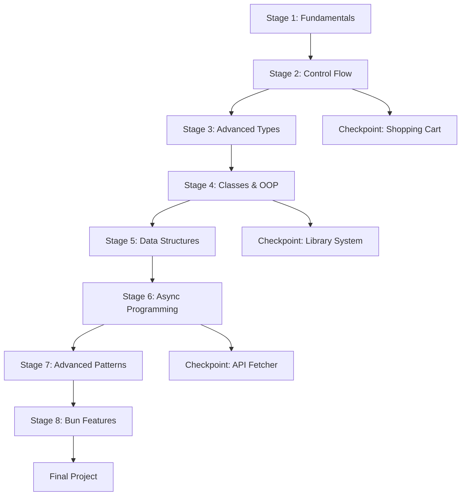

# TypeScript Curriculum Architecture

## Overview

Progressive TypeScript curriculum organized into 8 stages, from fundamentals to advanced Bun-specific features.

## Directory Structure

```
curriculum/
├── stage-01-fundamentals/          # Types, variables, functions, objects, arrays
├── stage-02-control-flow/          # Conditionals, loops, array methods
├── stage-03-advanced-types/        # Generics, utility types, type guards
├── stage-04-classes-oop/           # Classes, inheritance, abstract classes
├── stage-05-data-structures/       # Maps, Sets, destructuring
├── stage-06-async/                 # Promises, async/await
├── stage-07-advanced-patterns/     # Decorators, DI, type manipulation
└── stage-08-bun-features/          # Bun.serve, SQLite, file ops

checkpoints/                        # Comprehensive exercises
├── stage-02/
├── stage-04/
└── stage-06/

archive/                           # Backed up solutions
└── completed-solutions/
```

## Lesson Format

Each lesson follows this structure:
- **Parts 1-4**: Concept explanations with working examples
- **Your Turn**: TODO exercises (empty functions to implement)
- **Mini Challenge**: Comprehensive build task

## Mermaid Diagram


