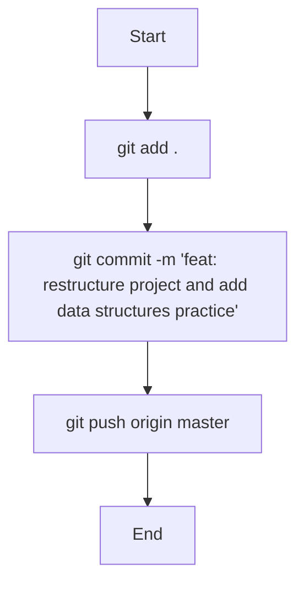

# Implementation Plan - Commit and Push Changes

The objective is to stage all current changes, commit them with a descriptive message, and push to the remote repository.

## User Review Required

> [!IMPORTANT]
> I will be staging all changes, including deletions and new files. Following the porcelain status, it looks like a major restructuring has happened.

- **Changes Summary**:
    - **Deleted**: Old flat files (`basics.ts`, `awilix-guide.ts`, etc.) and some cursor rules.
    - **Added**: New structured directories (`basics/`, `control-flow/`, `data-structures/`, `dependency-injection/`).
    - **Modified**: `package.json`.

## Proposed Changes

### Git Actions

#### 1. Stage Changes
- Run `git add .` to stage all modifications, deletions, and new files.

#### 2. Commit
- Run `git commit -m "feat: restructure project and add data structures practice"`

#### 3. Push
- Run `git push origin master`

## Verification Plan

### Automated Tests
- Check `git status` after push to ensure working tree is clean.
